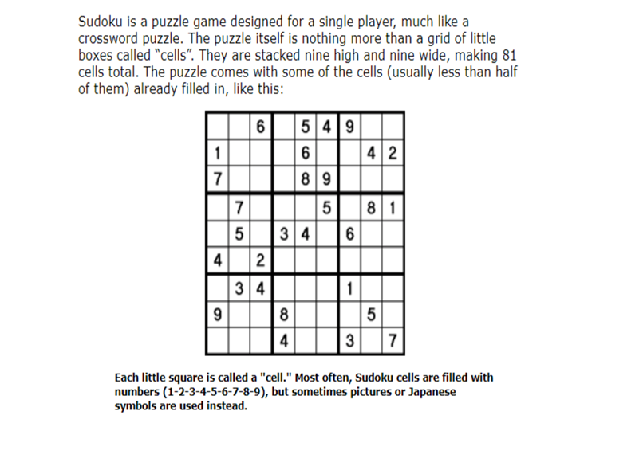

<h1>Project 2: Sudoku Solver</h1>

A C Program that takes a matrix of 9x9 as an input off sudoku with empty spaces as 0 and then displays the solution in the form of matrix as output.
 

<h4>What is SUDOKU?</h4>

<h4>Technology Used :</h4>

1)Programming Language :- C
 
2) Software :- Visual Studio Code (1.52.1)
 
3)Platforms :- Geeks for Geeks:

https://www.geeksforgeeks.org/sudoku-backtracking- 7/ (For Logic understanding)

<h4>Steps to run project :-</h4>
 
1) Download ZIP and extract the file on your local system or clone repository using below command in command prompt :
 
2)  Open cloned file in Visual Studio Code
 
3)  Open Terminal >> Run Build Task.. (or Ctrl + F7)
 
4)  In Terminal below , after successful build,	Run following commands :
 
• gcc sudoku.c (program_name.c)
• .\sudoku.exe
 

 
<h4>Method / Approach Used:</h4>

<h4>Question: Implement a Sudoku solver. (a classic Sudoku board is 9x9)</h4>

The Rules of Sudoku:

Approach: The backtracking approach.

We are working with numbers 1 through 9. Each number can only
appear once in a: Row Column And one of the 3 x 3 sub-boxes.
We can traverse and place an entry in empty cells one by one. We
then check the whole board to see if it is still valid. If it is we continue
our recursion. If it is not we do not even follow that path. When all
entries have been filled, we are finished. The 3 Keys To 
Backtracking:
Our Choice What we place in an empty cell that we see. Our
Constraints Standard Sudoku constraints. We cannot make a
placement that will break the board. Our Goal Place all empty spaces
on the board. We will know we have done this when we have placed a
valid value in the last cell in our search which programmatically will be
the bottom right cell in the 2D matrix. Validating Placements Before
We Place Them INSIGHT: We could traverse every row, column, and
3x3 sub grid to perform validation but at every decision point we know
that we are adding onto a grid that is already valid. So we just check
the row, column, and sub grid of the item that has been added.
Whenever backtracking we know that every decision that we made
stayed within the constraint that we started with being that the board was valid. Complexities Since Sudoku is traditionally 9x9 we can't
really discuss complexities because nothing can scale. Solving
Sudoku generalized to n x n boards is a NP-Complete problem so we
know for sure that our time complexity is exponential at the very least.
